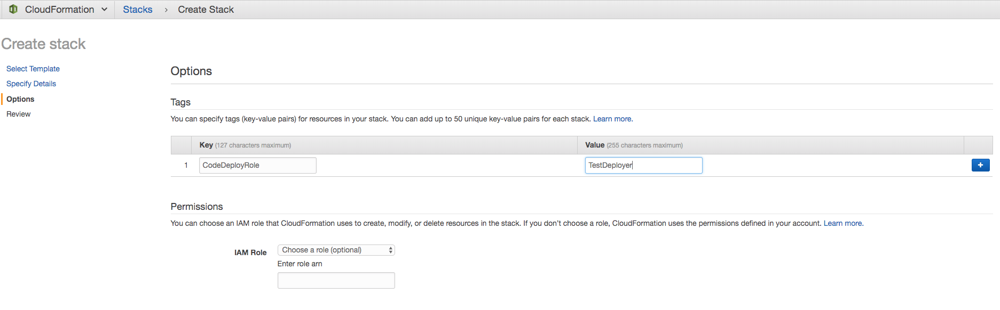
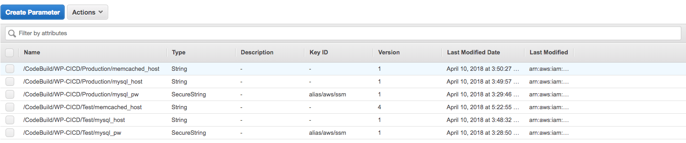

# Wordpress Continuous Delivery demo running on Kubernetes and AWS

This projects helps with getting started in the Kubernetes - AWS - CI/CD world by providing code samples and Cloudformation templates. You can build your own K8s cluster in AWS, and deploy your Wordpress app onto it with AWS provided CI/CD services in no time. Follow the instructions and try it out yourself!

## AWS costs and software licenses

You are responsible for the cost of the AWS services used while running the resources described in this guide. We do not charge extra costs for using this documentation and programs, templates.  Kubernetes and KOPS are free to deploy and uses the open-source Apache 2.0 license. Total Cloud Consulting is not responsible for the costs you have in AWS using the above deployment methods! By default, the deployment will use two t2.small instances for the cluster and one t2.micro instance for a bastion host for one environment (this tutorial uses 2 Wordpress Kubernetes environments). CI/CD components are charged based on storage, number of users (for CodeCommit) and execution time - for this tutorial, these are minor costs compared to the Kubernetes environments. For cost estimates, see the pricing pages. You may need to open a an AWS Support Ticket to increases EC2 service limits.

## Contents

### Wordpress Docker container related sources

The Wordpress Dockerfile contents was based on the official Wordpress implementation sources. In the sources/ directory only the php and js files are saved, in case you want to change the code in your implementation, the changes will be picked up by the CICD pipeline.

The build/ directory contains the Dockerfile and docker-entrypoint script which is required to get a Docker container running. In addition, a buildspec.yaml is provided for CodeDeploy configuration, and a tokenized template file for K8s deployment, which is prepared in build phase.

The deploy/ directory contains the scripts and configuration to deploy the Wordpress container to different K8s clusters. Scripts are provided for deploying Wordpress, validating if the deployment has finished with success, and for post-deploy cleanup.

### Kubernetes cluster and other resources for Wordpress

The smallest Kubernetes cluster implementation was taken from the [TC2 Kubernetes-AWS Github repo](https://github.com/totalcloudconsulting/kubernetes-aws)  with minor modifications. That means it comes with the least costs and fault tolerancy (referenced as "small footprint architecture"), as it is used for demonstration purposes only. There is an additional RDS and ElastiCache resources running in extra for Wordpress session and data persistence. The Cloudformation(cfn) template for creating Wordpress stack resources can be found under cfn/wp-cfn-demo.yml

### Continuous Integration and Delivery resources

CICD resources can be found in template cfn/cicd-tools.yml. The template will spin up the full Continuous Delivery pipeline, on which only a few configuration adjustments needs to be done to get it working. The following resources are created: CodeCommit Git repository, SNS topic for approval notifications, Elastic Container Registry to store Wordpress Docker images, CodeBuild to prepare sources for deployment and build Docker images, CodeDeploy to deploy the changes to the K8s cluster, and Codepipeline service to control the overall process between these components. All required IAM roles and policies are also created to grant permissions to the services interacting with each other.

### Architecture and tips

For more information about the architecture, tips and tricks, have a look at [this pdf paper](docs/architecture-and-tips.pdf).

## Steps to deploy the demo

1. Clone this repository's contents to your local workstation

2. Create a CICD stack by using cfn/cicd-tools.yml template. Make sure you specify a working email address of yours when creating the stack, otherwise you won't get notified of pending approvals in the deployment pipeline.

3. Create a Test environment by executing cfn/wp-cfn-demo.yml. Refer to [this documentation](https://github.com/totalcloudconsulting/kubernetes-aws/blob/master/docs/TC2_Abstratct_production_grade_Kubernetes_deployment_on_AWS.pdf) regarding the input parameters of the K8s cluster. Make sure you specify additonal custom tags for Test environment in Cloudformation(2nd page in CFN wizard) as specified in Step 2. when launching cfn/cicd-tools.yml template.

4. Create another environment for Production this time by executing the cfn/wp-cfn-demo.yml template again. Make sure this time you apply tags for Production environment key-value pairs!

5. Now we have a Test and Production environments for Wordpress, and a CICD pipeline yet to be configured. Let's create parameters in EC2 Parameters Store, so the pipeline will know how to configure the Wordpress instances. Look up the RDS MySQL and ElastiCache endpoints from the Cloudformation stack outputs, and add the following to Parameter Store:
  * /CodeBuild/WP-CICD/Test/mysql_pw: save the password of the Test environment's RDS Mysql as secret text
  * /CodeBuild/WP-CICD/Production/mysql_pw: save the password of the Production environment's RDS Mysql as secret text
  * /CodeBuild/WP-CICD/Test/mysql_host: Test environments RDS endpoint in "host:port" format.
  * /CodeBuild/WP-CICD/Production/mysql_host: Prod environments RDS endpoint in "host:port" format.
  * /CodeBuild/WP-CICD/Test/memcached_host: Test environments Elasticache endpoint in "tcp://host:port" format.
  * /CodeBuild/WP-CICD/Production/memcached_host: Prod environments Elasticache endpoint in "tcp://host:port" format.

6. Now let's take a look at the rest of the source files. Edit build/buildspec.yml file and search and replace for the following values:
  * <accountid>: your AWS account id
  * <region>: the region you are launching the stacks (e.g. eu-west-1). Also search for this parameter and replace in deploy/k8s_deploy.sh
  * dockerImageName: set it to the name of the ECR repository created (check from CFN output as ContainerRepository)

7. Next, check the CICD Cloudformation stack outputs and take a note of the ContainerRepository's name. Navigate to Elastic Container Service and commit all the sources from this repository, except cfn/ and docs/ folders.

8. This initial commit will already kick off the CodeDeploy pipeline to build a Docker container installing Wordpress, and adding any changes made in sources/ directory to Wordpress. The  container image containing the changes will be stored in ECR. Next, CodePipeline will deploy the Docker container based on k8s-deployment-template.yml template.

9. You should receive an email from SNS if already confirmed the subscription to the SNS topic. Go the CodePipeline and Approve or Reject the step for Deploy to Production to finish the workflow.
